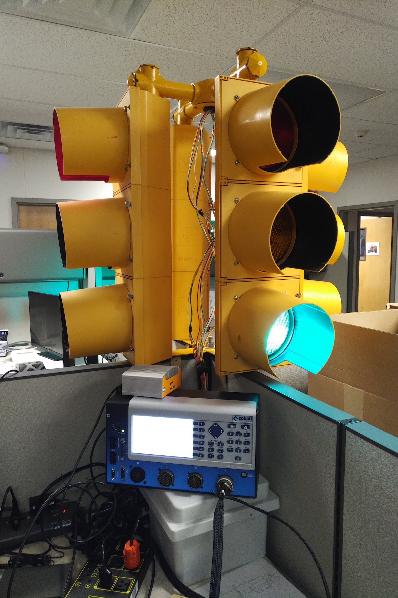
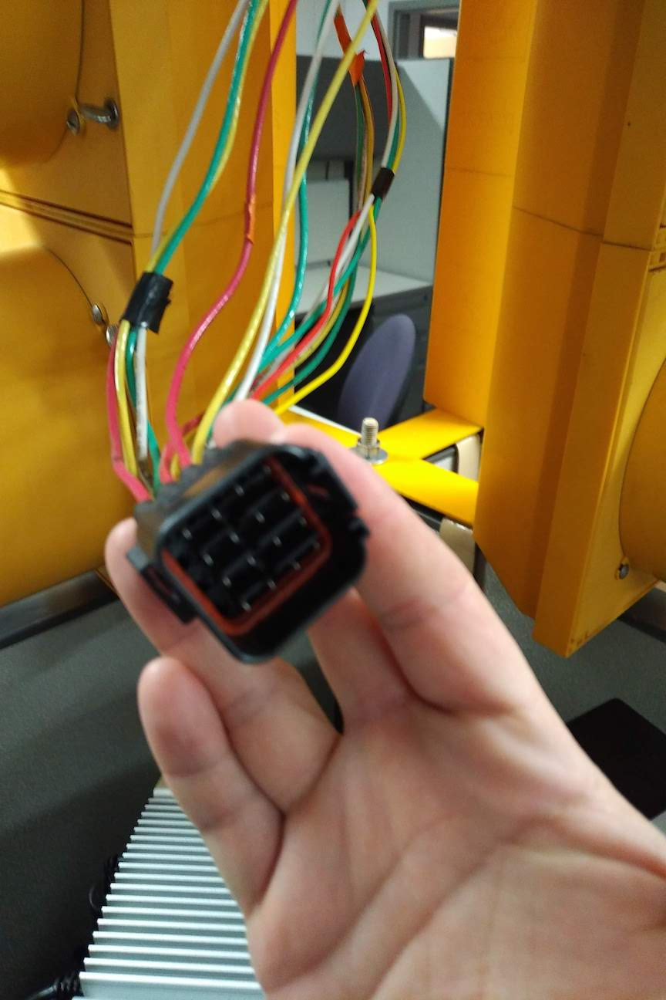
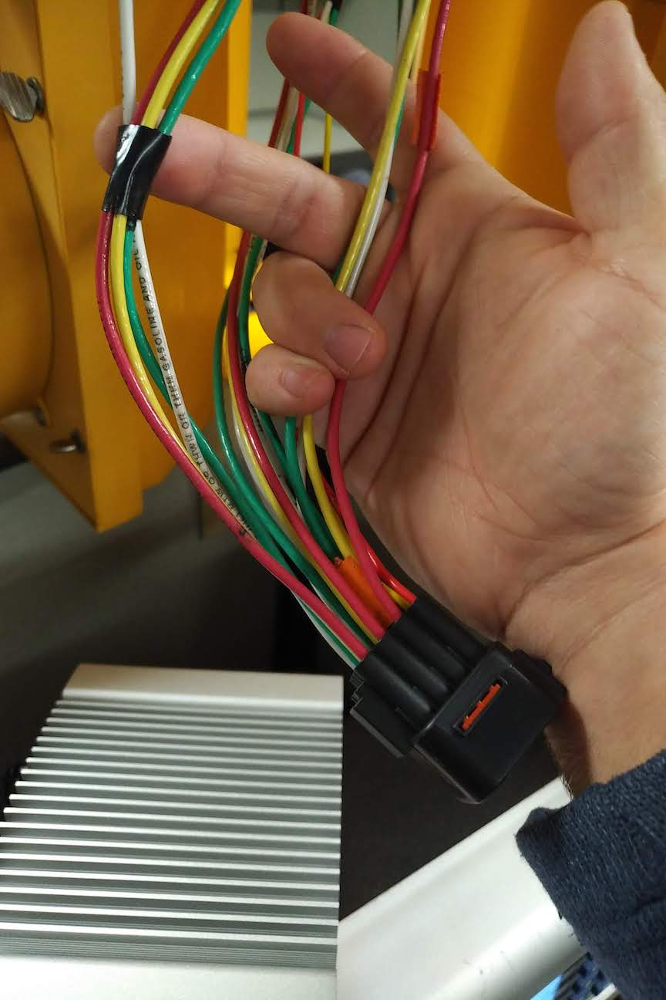
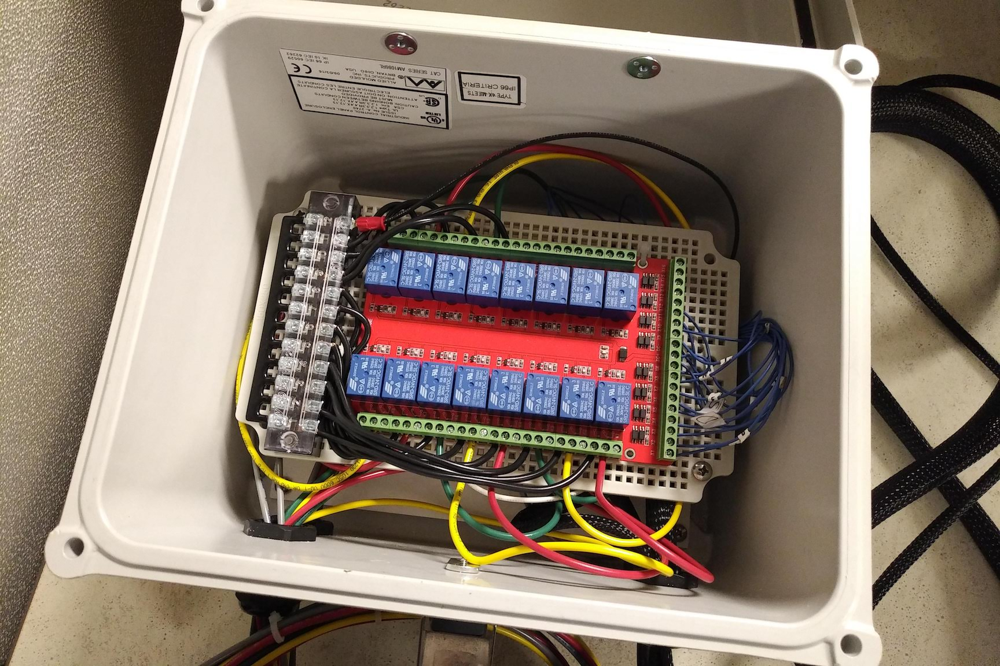
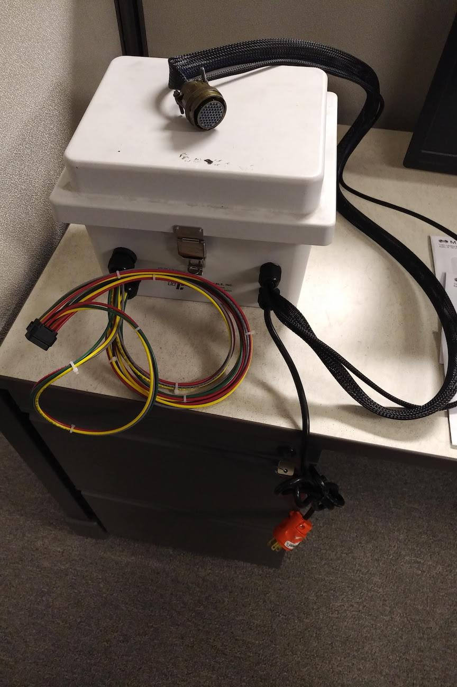
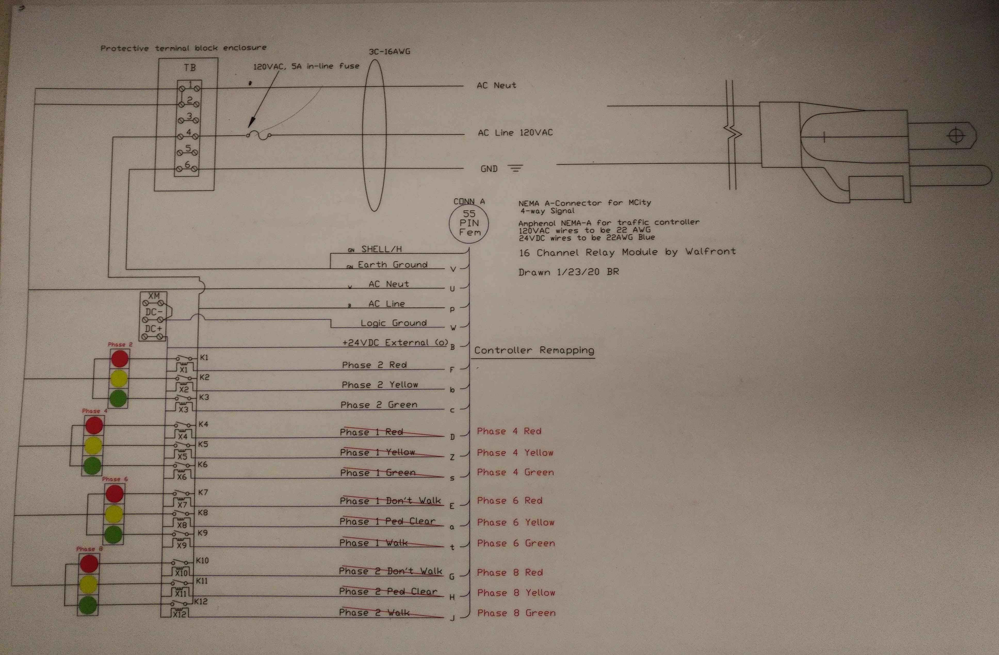

# Mcity Portable Traffic Signal

## Background
[Mcity](https://mcity.umich.edu) wished to run a standard traffic controller with attached signal in our office. We wanted to be able to test against a real traffic controller and have a better visualization than some of the tools which currently existed on the market for traffic control.

We'd like to thank [Econolite](https://www.econolite.com/) for providing the traffic controller to us for Mcity research. In addition, we'd like to offer a special thank you to Brian Raymond at [Carrier & Gable](https://carriergable.com/). Brian guided us through the project, assisted with controller configuration, and assembly of the Amphenol connection for us. While our original setup worked, Brian's contributions made this something we were not embarrassed to publish.

## Setup of traffic light
Through the help of our procurement team (Thanks, Janice!) we purchased a light from someone's basement via Craigslist (Thanks, Stranger!). Our tech (Thanks, Stan!) manufactured a Steelcase cubicle compatible traffic light mount.

The traffic signal we have is outfit with LED bulbs. We rewired each signal group to use a common ground and separate 120v line for each light. Those were wired into a 4x4 16 pin trailer harness. 4 wires per signal head, and run into the relay box via a cable gland. The connections in the light heads are made with spade connectors to terminal blocks mounted inside the lights.

## Traffic Controller Details
Our Traffic controller is an [Econolite](https://www.econolite.com/) Cobalt running EOS (vs ASC/3). The configuration provided in this repository runs the light off just the A connector on the controller.

We're running EOS 03.01.38 with recall on the lights enabled. With this feature on (not required on ASC/3) the controller will cycle constantly by default.

The configuration file is available in this repository and is named eos_controller.cfg. Load to the controller by USB or data key (MM-8-2). 

## BOM
If you build this with all new parts it's about a $15k setup.
If you build just the relay box expect to be out ~$200 for parts.

Reduce costs for the entire setup further by sourcing a light and traffic controller used.

* [Econolite Cobalt Traffic Controller](https://www.econolite.com/products/controllers/cobalt/)
* Wire (various gauge)
* Spade connectors
* 16 pin wire harness terminal (https://www.amazon.com/EMeskymall-Motorcycle-Waterproof-Electrical-Connector/dp/B074LJ4NGJ)
* Waterproof enclosure (10x8x8 at least)
* Power cord
* Amphenol NEMA-A connector 55 pin FEMALE
* Terminal Block w/ Barrier strip (https://www.amazon.com/Positions-Terminal-Pre-Insulated-Barrier-MILAPEAK/dp/B07CLW5FPS)
* 16 Channel DC 24v High/Low Trigger Relay Board (https://www.amazon.com/gp/product/B07P6WTPRR)
* Waterproof glands (https://www.amazon.com/gp/product/B07Q2TYSTM/)

## Building the box
Our enclosure has built in standoffs. Mount a connector block inside the waterproof enclosure, and the relay board and a second connector block to your standoffs. Allow room for lots of wires.

120v Power runs into the relay box, out to the traffic signal lights, and out to the traffic controller. The traffic controller takes 120v on connector A and outputs 24v for signal wires and constant power. Our relay board is powered by 24V DC, so by applying power to the traffic controller, we can use its power output to power and control the relay board. We split the 120v wiring from the 24v signal wires inside the box and sleeve them separately for running into the Amphenol connector. See wiring diagram for more details.

- Drill holes for 4 cable glands
    - 120v power in
    - 120v power to controller
    - 24v signal and power lines from/to controller
    - Harness to traffic signal
- Attach pins for signal and 120v power to Amphenol connector (see wiring diragra)
- Attach neutral to bus bar, wire neutral from each signal head to bus bar. 
- Attach fuse to 120v incoming power line.
- Attach 24v constant power from controller to relay board and set relay board to trigger on high values
- Attach hot to each relay input, and run output wire to hot for each signal head light.
- Triggering a relay (24v to each pin) should now trigger a corresponding light on the signal head. 
- Power box via connection to traffic controller.

## Wiring Diagram
Courtesy of [Carrier & Gable](https://carriergable.com/)

## Further use case.
See the [Mcity TSCBM repository](https://github.com/mcity/Mcity-V2X-TSCBM) for a parser capable of decoding the TSCBM signal phase and timing (SPaT) message broadcast from this controller. This can be used to feed a V2X DSRC/CV2X RSU or other use cases. 

If you require a more full-fledged test facility / city control system, please see [Mcity OCTANE](https://go.um.city/license).

## Thanks!
Special thanks to [Mcity](https://mcity.umich.edu) for supporting this work. Thanks again to [Carrier & Gable](https://carriergable.com/) for providing technical advice, construction of the connector, and EOS configuration work!
